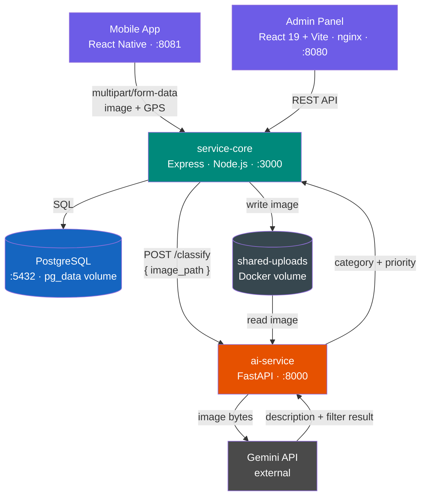

# SRMS — Infrastructure Report Management System

Citizen-facing platform for municipal infrastructure reporting. Citizens submit photo + GPS reports via mobile app; AI categorizes and prioritizes them; admin staff review and dispatch to relevant departments.

UI language is **Turkish** — target audience is Turkish municipal staff and citizens.

**Flow: Citizen → Mobile App → Backend API → AI Analysis → Admin Panel → Relevant Municipal Department**

---

## Architecture



| Module | Tech | Purpose |
|---|---|---|
| `client-mobile` | Expo + React Native | Citizen app — submit & track reports |
| `client-admin` | React 19 + Vite + Leaflet | Admin panel — review, map, personnel |
| `service-core` | Express + TypeScript + Sequelize | REST API + business logic |
| `ai-service` | FastAPI + DistilBERT ONNX + Gemini | Image classification pipeline |

---

## Project Structure

```
srms-26/
├── client-mobile/          # Expo React Native app
│   ├── app/                # Screens (expo-router)
│   ├── context/            # Auth + Report contexts
│   ├── services/           # API clients
│   └── Dockerfile
│
├── client-admin/           # React + Vite admin panel
│   ├── src/
│   │   ├── components/     # Modals, panels, map
│   │   ├── types.ts
│   │   └── utils.ts
│   └── Dockerfile
│
├── service-core/           # Express API
│   ├── src/
│   │   ├── controllers/
│   │   ├── models/         # User, Report (Sequelize)
│   │   ├── routes/
│   │   ├── services/       # Business logic, AI integration
│   │   ├── middleware/     # Auth, error handler
│   │   └── scripts/        # DB seed
│   └── Dockerfile
│
├── ai_service/             # FastAPI AI pipeline
│   ├── app.py              # ONNX classifier + Gemini
│   ├── main.py             # HTTP endpoints
│   └── Dockerfile
│
└── docker-compose.yml
```

---

## Stack

### Mobile (`client-mobile`)
- React Native + Expo SDK 54
- expo-router, expo-image-picker, expo-location
- Axios + JWT interceptor, expo-secure-store

### Admin Panel (`client-admin`)
- React 19 + TypeScript + Vite
- Leaflet + react-leaflet-cluster
- nginx (production static serving)

### Backend (`service-core`)
- Node.js 20, Express.js, TypeScript (ESM)
- Sequelize ORM + PostgreSQL
- JWT + bcrypt, Multer (file upload)
- Helmet, CORS, Morgan

### AI Service (`ai-service`)
- FastAPI + uvicorn
- Gemini API — image analysis + troll filtering
- DistilBERT ONNX — text classification (14 categories)

---

## Report Lifecycle

```
pending → in_review → in_progress → resolved
                    ↘ rejected ↗  (admin can re-open)
```

| Status | Description |
|---|---|
| `pending` | AI analyzing in background |
| `in_review` | Awaiting admin/reviewer decision |
| `in_progress` | Approved or corrected, field team working |
| `resolved` | Closed |
| `rejected` | Rejected with mandatory reason |

Troll-filtered reports (NSFW, non-photo, indoor) are auto-rejected without entering the review queue.

---

## Quick Start

**Requires:** Docker + Docker Compose

```bash
git clone <repo-url>
cd srms-26
# Add GEMINI_API_KEY to ai_service/.env
docker-compose up --build
```

| Service | URL |
|---|---|
| Admin Panel | http://localhost:8080 |
| Backend API | http://localhost:3000/api |
| Mobile (Metro) | http://localhost:8081 |
| AI Service | http://localhost:8000 |
| PostgreSQL | localhost:5433 |

**Test accounts** (seeded on first run):

| Role | Email | Password |
|---|---|---|
| `admin` | admin@ankara.bel.tr | admin123 |
| `review_personnel` | review@ankara.bel.tr | review123 |

---

## API Endpoints

### Auth
```
POST  /api/auth/register
POST  /api/auth/login
POST  /api/auth/logout
GET   /api/auth/me
```

### Reports
```
POST   /api/reports                   # Submit report (multipart/form-data)
GET    /api/reports/my                # Own reports (user)
GET    /api/reports                   # All reports (admin, review_personnel)
GET    /api/reports/:id
PATCH  /api/reports/:id/review        # Approve / correct / reject
PATCH  /api/reports/:id/status        # Workflow status change (admin)
DELETE /api/reports/:id               # Admin only
GET    /api/reports/images/:filename  # Serve uploaded image
```

### Users (Admin only)
```
GET    /api/users
POST   /api/users
PATCH  /api/users/:id/active
DELETE /api/users/:id
```

---

## Key Design Decisions

- **Shared volume** — images written once by service-core, read directly by ai-service. No network transfer of file bytes between services.
- **Async AI** — `POST /reports` returns immediately with `status: pending`; AI updates the report in the background.
- **Single status field** — `status` drives the entire workflow; `reviewStatus` records only the reviewer's decision (`approved | corrected | rejected`).
- **reviewedBy** — every review decision is attributed to a user; resolved via DB JOIN, not client-side lookup.

---

## Troubleshooting

| Issue | Solution |
|---|---|
| Port already in use | `lsof -i :<port>` → `kill -9 <PID>` |
| DB connection failed | `docker ps` — check all containers are running |
| Mobile can't reach backend | Use machine's local IP in `.env.development`, not `localhost` |
| AI service crash | Check `GEMINI_API_KEY` in `ai_service/.env` |
| Reports stuck at `pending` | AI service may be down — check `docker logs srms-26-ai-service-1` |

---

## Module READMEs

- [client-admin](client-admin/README.md)
- [client-mobile](client-mobile/README.md)
- [service-core](service-core/README.md)

---

## Versioning

This monorepo uses **parallel versioning** — all modules (`client-admin`, `client-mobile`, `service-core`) share a single version number at all times.

### Rationale

The three modules are tightly coupled by design:

- `client-admin` and `client-mobile` both consume the same `service-core` REST API. A breaking change in the API contract (status enum, field rename, endpoint restructure) requires simultaneous updates across all three modules.
- There are no independent release cycles. Features and fixes ship together as a single deployable unit via `docker-compose`.
- A single version tag on the monorepo unambiguously identifies the state of the entire system — there is no "which mobile version is compatible with which admin version" problem.

This matches the **fixed/locked mode** recommended for monorepos where modules evolve together (as opposed to independent mode, which is appropriate when teams and release cadences diverge).

### Bumping the version

```bash
./scripts/version.sh <version>
```

This updates `package.json` in all three modules and `app.json` in `client-mobile` in one step. Run from the repo root.

---

## License

Internal use only.
